## Описание
Проект представляет собой административное приложение для управления пользователями, меню и бронированиями, с возможностью авторизации и редактирования данных.

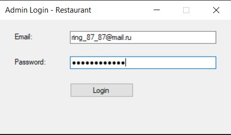
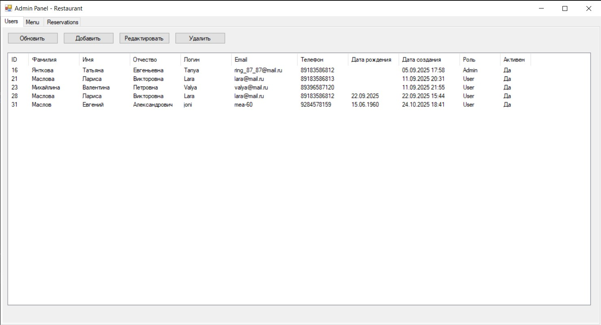
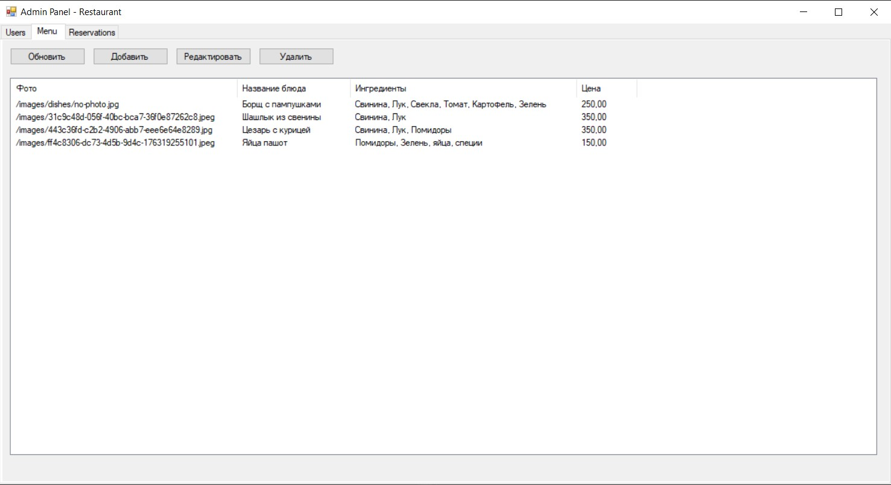
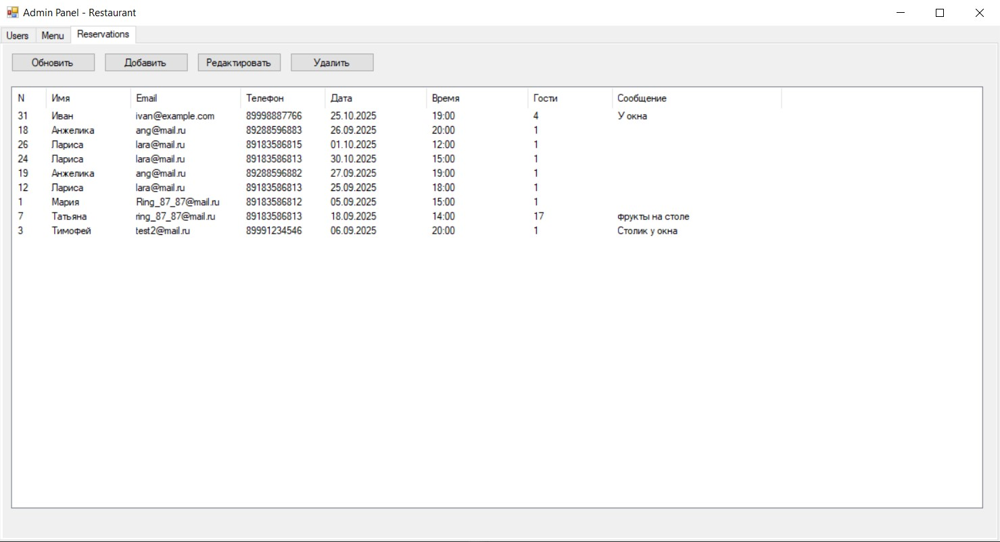
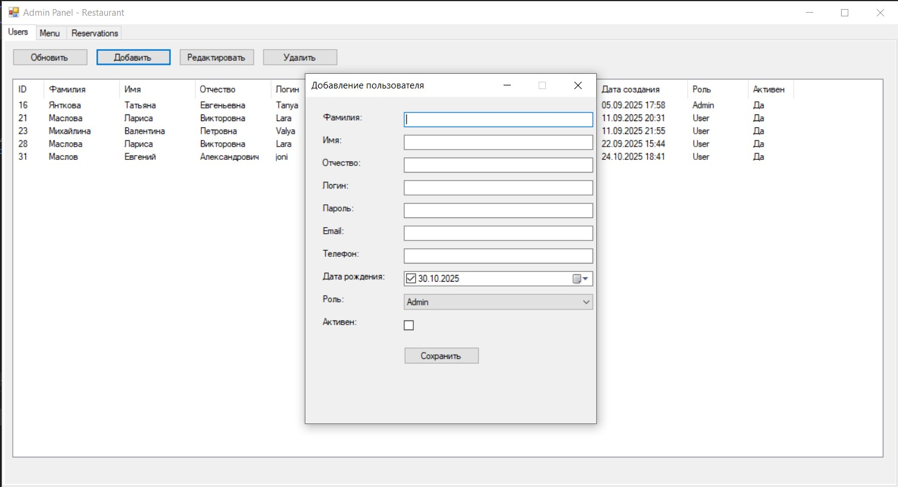
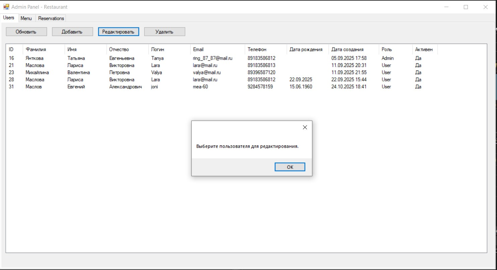
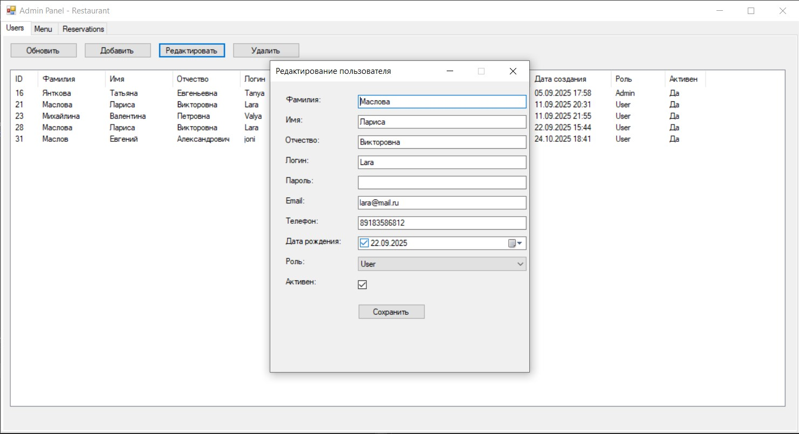
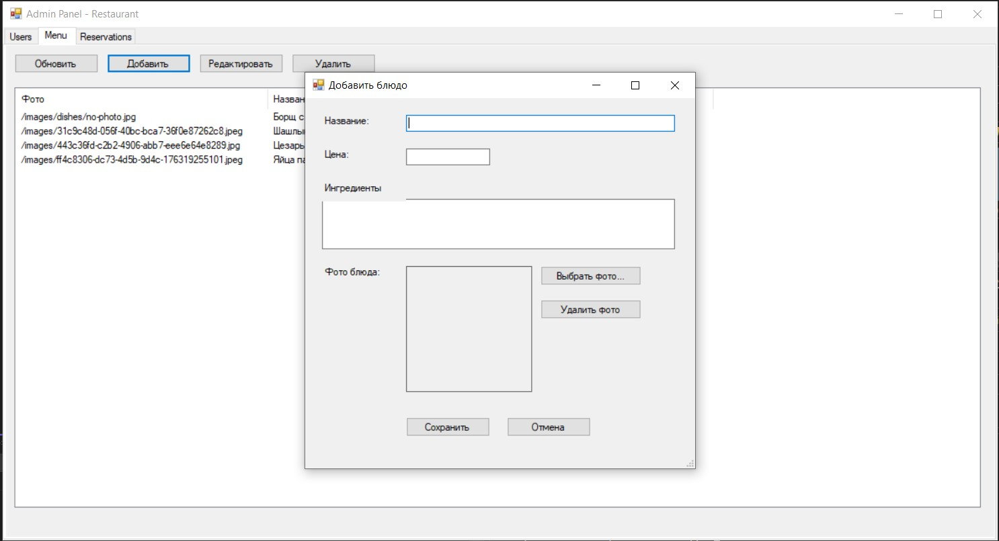
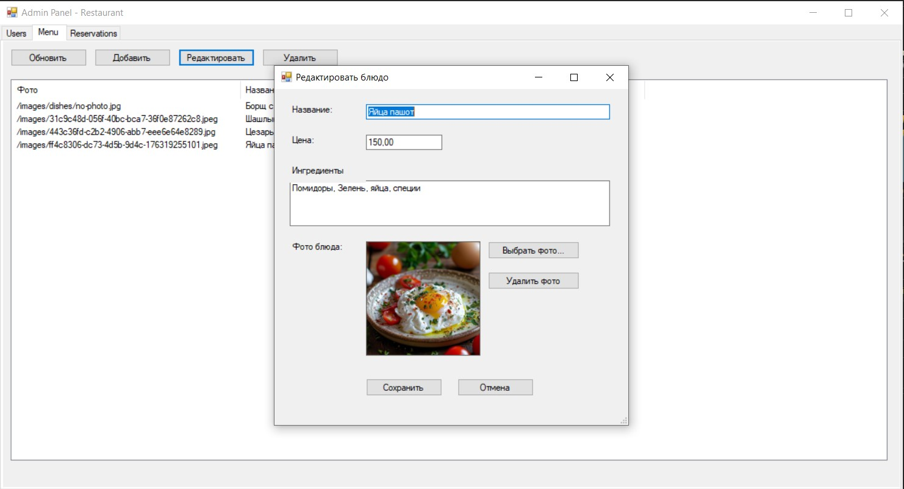

## Возможности

- Авторизация пользователей через форму входа.

- Панель администратора с доступом к данным пользователей, меню и бронирований.

- Добавление, редактирование и удаление записей (CRUD-функционал).

- Работа с JSON и асинхронными операциями через встроенные библиотеки .NET.

- Локализация интерфейса с использованием `.resx` файлов ресурсов.

## Используемые технологии

- **C# / .NET Framework 4.7.2**
- **Windows Forms**
- **NuGet Packages:**
  - `System.Text.Json`
  - `System.Memory`
  - `System.IO.Pipelines`
  - `Microsoft.Bcl.AsyncInterfaces`
  - `System.ValueTuple`
- **IDE:** Visual Studio

## Запуск и установка

1. Сначала склонируйте репозиторий и запустите web-приложение (сервер):

   ```bash
   git clone https://github.com/Tat-T/Restaurant.git (сервер web-приложение)

2. Склонируйте репозиторий: 

   ```bash
   git clone https://github.com/Tat-T/WinFormsRest.git (Windows Forms приложение)

3. Откройте решение в Visual Studio (WindowsAdminApp.sln).

4. Восстановите NuGet-пакеты:

   ```bash
   Tools → NuGet Package Manager → Restore Packages

5. Выберите конфигурацию Debug или Release.

6. Запустите проект (F5) или соберите исполняемый файл.

## Данные для проверки:

E-mail: admin@mail.ru

Password: admin

### Пример API-запроса

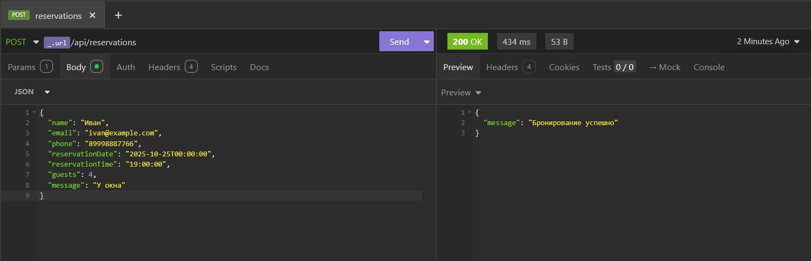
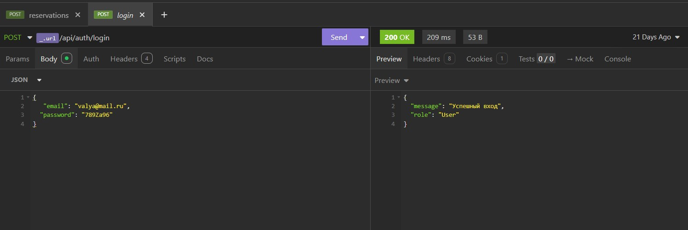
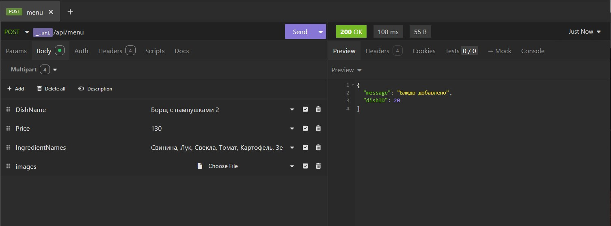